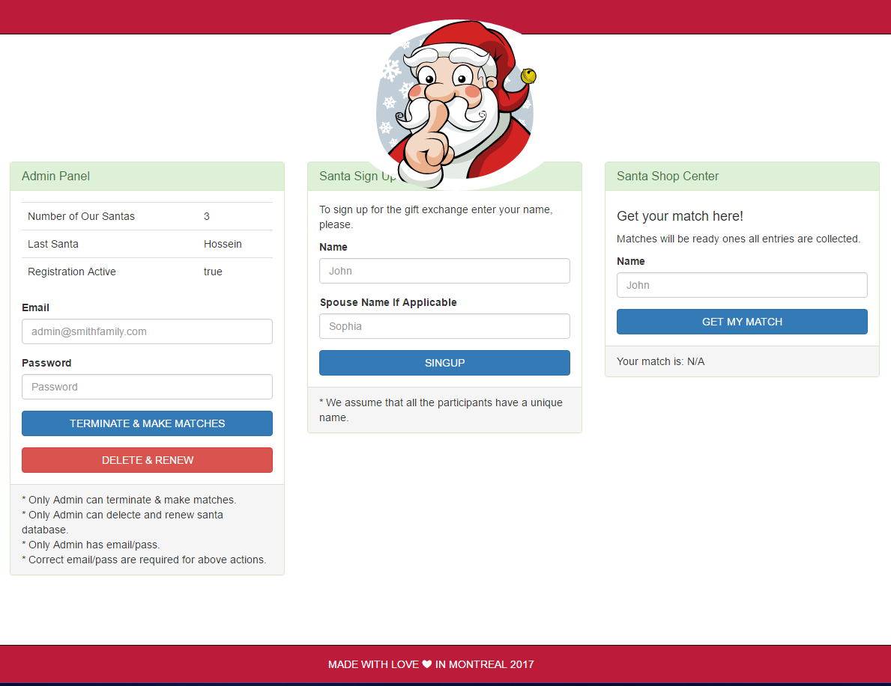

# Secret Santa
Secret Santa :santa: is a Western Christmas tradition in which members of a group or community :family:are randomly assigned a person to whom they anonymously :alien: give a gift :gift:. This is a MEAN stack app for secret Santa.

## Demo

## APIs and technologies used so far
- HTML5, CSS, JS, [Bootstrap](http://getbootstrap.com/)
- [AngularJS 1.X](https://angularjs.org/)
- [NodeJS](https://nodejs.org/en/)
- [Express](http://expressjs.com/)
- [MongoDB](https://www.mongodb.org/), [MonngoLab](https://mlab.com/welcome/)
- [Yarn](https://yarnpkg.com/lang/en/) Facebook Package Manager
- [GulpJS](http://gulpjs.com/): As my building tool
- [SASS](http://sass-lang.com/): css of this project was short. but for warm up I put some SASS codes.

## APIs and technologies in the next few days :stuck_out_tongue_closed_eyes:
Time for this project was short. I have to add more stuff into that soon

- [JSdoc](http://usejsdoc.org/): To provide documentation for the JS codes. Codes are currently commented wisely for this
- [Jasmine](https://jasmine.github.io/): As my test framework.

## How to make it work on your machine
- Assumptions: You have 'Linux like terminal', `node` and `yarn` on your machine
- Clone the repository on your computer
- Run `yarn` in the `root directory`, and in the `app` directory of the project to get all of the dependencies.
- You need a `config` folder inside project `root`, and inside `config` should be two files `config.js` and `development.json. I can't put the here due to sensitive data.
- Type `npm start` or `node server.js` in the working directory shell.
- Go to your browser and type `localhost:3000` or `http://localhost:3000/`

## License

The contents of this repository are covered under the [GPL License](LICENSE.txt). Please be Advised before redistributing.
Start, fork, and collaboration is always welcomed  :heart: as it is a fun project for me.
